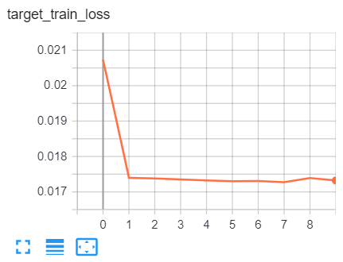
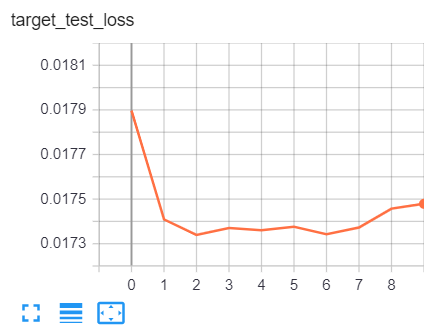
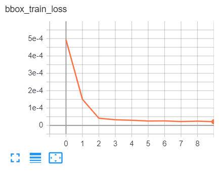
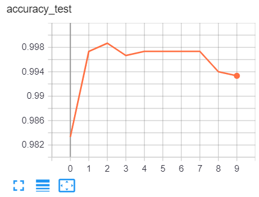
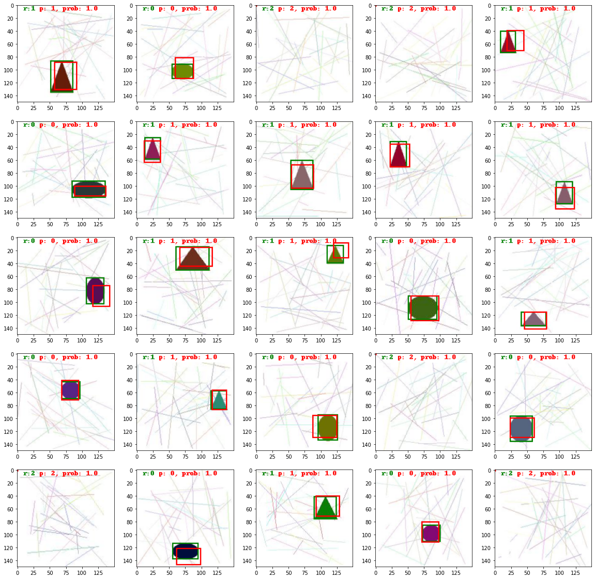

# DETECCAO_OBJETOS_2_0
 Detecção de objetos

- Teste e aprendizado para classificação e detecção de imagens para um dataset fictício, de 15.000 imagens de triângulo e círculos.

- A parte inicial do modelo segue conforme o código abaixo:  
```
self.backbone = nn.Sequential(
            
            nn.Conv2d(in_channels=3, out_channels=256, kernel_size=3, stride=1, padding=0),
            nn.BatchNorm2d(num_features=256),
            nn.LeakyReLU(negative_slope=0.2),
            nn.MaxPool2d(kernel_size=2),

            nn.Conv2d(in_channels=256, out_channels=128, kernel_size=3, stride=1, padding=0),
            nn.BatchNorm2d(num_features=128),
            nn.LeakyReLU(negative_slope=0.2),
            nn.MaxPool2d(kernel_size=2),

            nn.Conv2d(in_channels=128, out_channels=64, kernel_size=3, stride=1, padding=0),
            nn.BatchNorm2d(num_features=64),
            nn.LeakyReLU(negative_slope=0.2),
            nn.MaxPool2d(kernel_size=2),

            nn.Conv2d(in_channels=64, out_channels=1, kernel_size=3, stride=1, padding=0),
            nn.BatchNorm2d(num_features=1),
            nn.LeakyReLU(negative_slope=0.2),
            nn.MaxPool2d(kernel_size=2),

        )
```
- E sua parte final tem duas saídas:

- A que prevê o bbox do objeto:  
```
self.pbox = nn.Sequential(
            self.backbone,
            nn.Flatten(),
            nn.Linear(in_features=in_features, out_features=512, bias=True),
            nn.ReLU(),
            nn.Linear(in_features=512, out_features=256, bias=True),
            nn.ReLU(),
            nn.Linear(in_features=256, out_features=4, bias=True),
            nn.ReLU()
        )
```  

- E a que prevê a classe do objeto:  
```
self.pclasse = nn.Sequential(
            self.backbone,
            nn.Flatten(),
            nn.Linear(in_features=in_features, out_features=128, bias=True),
            nn.ReLU(),
            nn.Linear(in_features=128, out_features=64, bias=True),
            nn.ReLU(),
            nn.Linear(in_features=64, out_features=3),
            nn.Softmax(dim=-1)
        )
```  

- E as funções perda são:  
```
criterion_bbox = nn.MSELoss()
criterion_target = nn.CrossEntropyLoss()
```

- E otimizador:  
```
optimizer = torch.optim.Adam(model.parameters(), lr=0.001)]
```

- Os resultados do treinamento para classificação do objeto são:  

  

- E para detecção dos objetos:  



- E acurácia do modelo:  


- E por último uma amostra do resultado final das classificações e detecções:  
